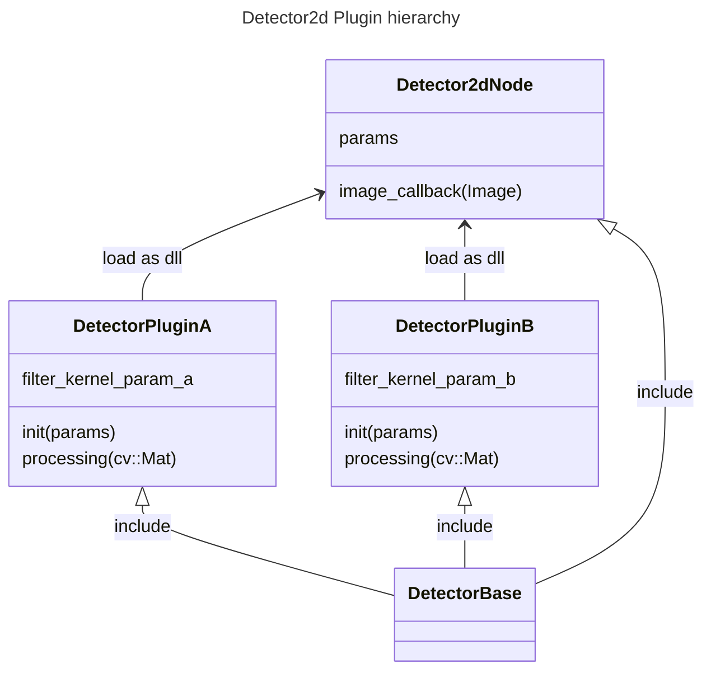

# Detector2d
Detection 2d node for CoRE-1 2024


## test

```bash
mkdir -p ~/ros2_ws/src
cd ~/ros2_ws/src
git clone https://github.com/StrayedCats/detector2d.git -b humble

cd ..
colcon build

source install/setup.bash
ros2 run detector2d_node detector2d_node_exec --ros-args -p load_target_plugin:=detector2d_plugins::PublishCenter
```

## Node Structure

### Topic (Subscribe)

| Topic Name | Type | Description |
| --- | --- | --- |
| image_raw | sensor_msgs/msg/Image | Raw image from camera |

### Topic (Publish)

| Topic Name | Type | Description |
| --- | --- | --- |
| positions | geometry_msgs/msg/Detection2DArray | Detected 2d poses |

### Class Diagram


