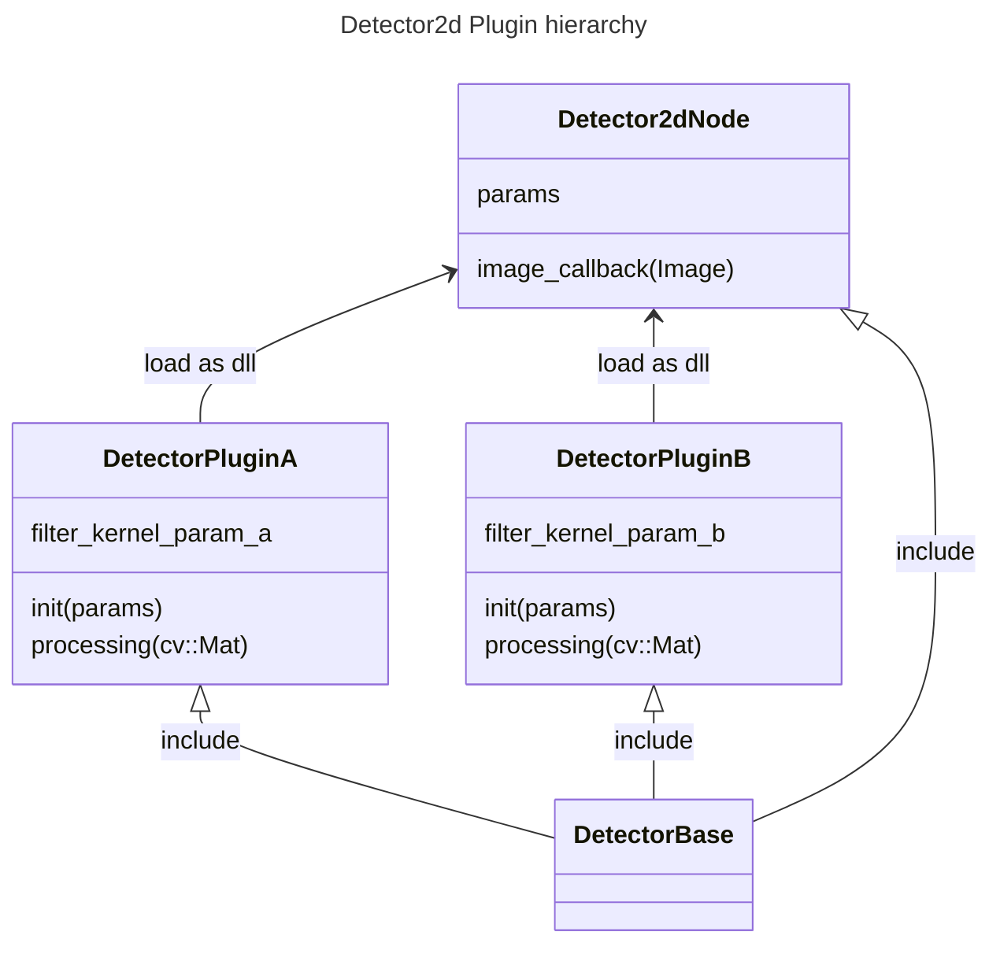

# Detector2d
Detection 2d node for CoRE-1 2024

## Node Structure

### Topic (Subscribe)

| Topic Name | Type | Description |
| --- | --- | --- |
| image_raw | sensor_msgs/msg/Image | Raw image from camera |

### Topic (Publish)

| Topic Name | Type | Description |
| --- | --- | --- |
| positions | geometry_msgs/msg/Detection2DArray | Detected 2d poses |

### Class Diagram

