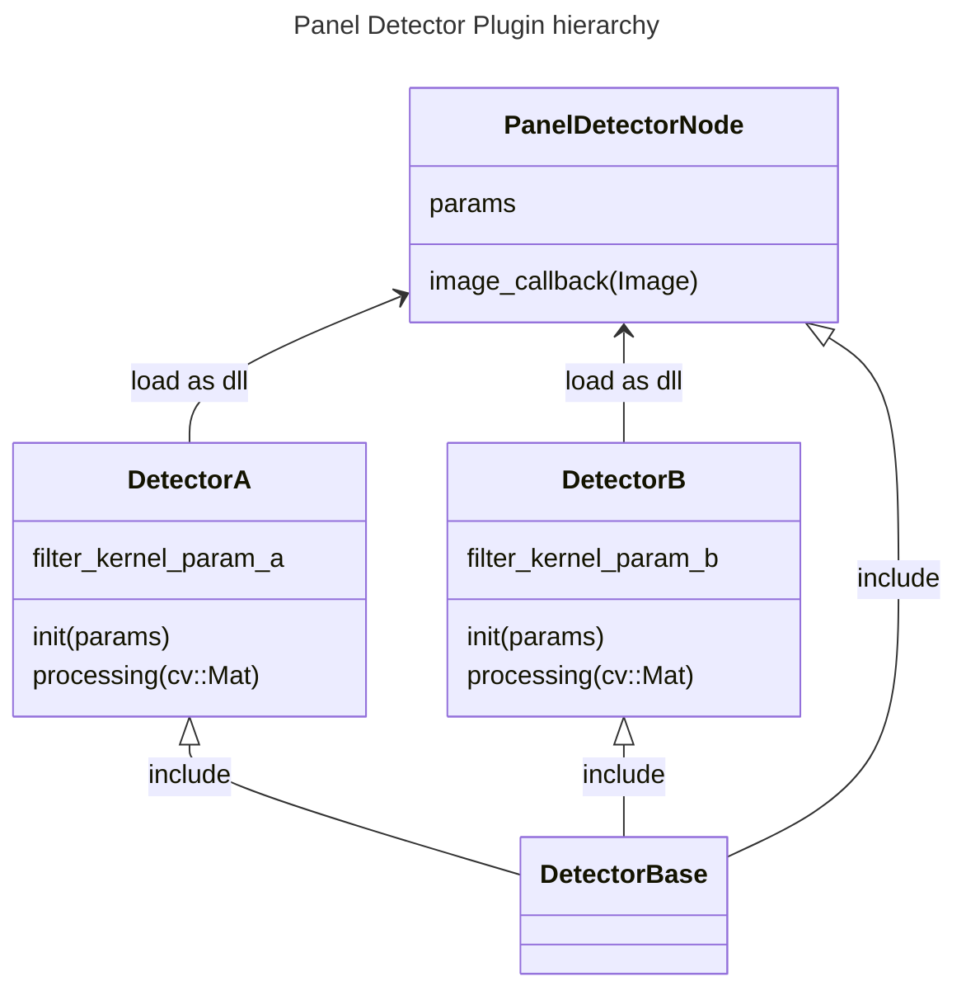

# PanelDetector
Panel detection node for CoRE-1 2024

```mermaid
---
title: Panel Detector Plugin hierarchy
---
classDiagram
    PanelDetectorNode <-- DetectorA : load as dll
    PanelDetectorNode <-- DetectorB : load as dll
    DetectorA <|-- DetectorBase : include
    DetectorB <|-- DetectorBase : include
    PanelDetectorNode <|-- DetectorBase : include
    PanelDetectorNode: params
    PanelDetectorNode: image_callback(Image)
    class DetectorA{
        filter_kernel_param_a
        init(params)
        processing(cv::Mat)
    }
    class DetectorB{
        filter_kernel_param_b
        init(params)
        processing(cv::Mat)
    }
```
